# 스마트 기자재 대여 관리기 최종보고서

## 실험의 목적과 범위

## 분석

## 설계 

## 구현

### 1. 구현 환경

본 프로젝트는 웹 기반 기자재 대여 관리 시스템으로, 서버와 클라이언트가 분리된 구조로 구현하였다.

- **개발 도구**
  - Visual Studio Code
  - MySQL Workbench
  - Postman (API 테스트)

- **서버 환경**
  - Node.js (Express)
  - MySQL (데이터베이스)
  - node-cron (스케줄링 처리)

- **클라이언트**
  - React

### 2. 서버 / 클라이언트 구조

본 시스템은 REST API 기반의 클라이언트-서버 구조로 설계되었다.

- 클라이언트: 사용자 인터페이스 및 요청 처리 (React)
- 서버: API 제공 및 비즈니스 로직 처리 (Node.js)
- 데이터베이스: 사용자, 기자재, 대여, 알림 정보 저장 (MySQL)

클라이언트는 HTTP 요청을 통해 서버 API를 호출하고, 서버는 JSON 형식으로 응답을 반환한다.

### 3. 사용 기술 및 라이브러리

- Express: 서버 및 REST API 구축
- mysql2: MySQL 데이터베이스 연결
- bcryptjs: 비밀번호 암호화
- jsonwebtoken (JWT): 인증 처리
- multer: 파일 업로드 (학생증 인증)
- qrcode: QR 코드 생성
- node-cron: 자동 스케줄링 처리
- cors: 클라이언트-서버 통신 허용

### 4. API 설계

본 시스템은 RESTful API 방식으로 구현하였다.  
각 기능은 역할에 따라 사용자와 관리자 권한을 구분하여 설계하였다.

주요 API 목록은 다음과 같다.

#### 공통 API

| 기능 | 메서드 | API |
|------|--------|-----|
| 회원가입 | POST | /api/signup |
| 로그인 | POST | /api/login |
| 로그아웃 | GET | /api/logout |
| DB 연결 확인 | GET | /api/test-db |

#### 사용자 API

| 기능 | 메서드 | API |
|------|--------|-----|
| 사용자 아두이노 조회 | GET | /api/get-aduino |
| 사용자 라즈베리파이 조회 | GET | /api/get-raspberryPi |
| 사용자 노트북 조회 | GET | /api/get-laptop |
| 기자재 대여 | POST | /api/rentals |
| 사용자 대여 내역 조회 | GET | /api/rentals |
| QR 스캔 | POST | /api/qr-scan |
| 사용자 알림 조회 | GET | /api/notification |
| 사용자 알림 읽음 처리 | PUT | /api/notification/read/:id |

#### 관리자 API

| 기능 | 메서드 | API |
|------|--------|-----|
| 가입 대기자 조회 | GET | /api/admin/get-data |
| 관리자 승인 | PUT | /api/admin/approval/:id |
| 관리자 거절 | PUT | /api/admin/reject/:id |
| 관리자 승인 대기 목록 조회 | GET | /api/admin/pending-users |
| 기자재 전체 조회 | GET | /api/admin/items |
| 기자재 상세 조회 | GET | /api/admin/items/:id |
| 기자재 QR 조회 | GET | /api/admin/items/:id/qr |
| 기자재 등록 | POST | /api/admin/add-item |
| 기자재 수정 | PUT | /api/admin/update-item/:id |
| 기자재 삭제 | DELETE | /api/admin/delete-item/:id |
| 관리자 반납 처리 | PUT | /api/admin/return/:rentalId |
| 관리자 전체 대여 조회 | GET | /api/admin/rentals |
| 관리자 이슈 로그 조회 | GET | /api/admin/issues |
| 관리자 대시보드 조회 | GET | /api/admin/dashboard |

모든 인증이 필요한 API는 JWT 기반으로 보호되며, 관리자 기능은 별도의 권한 검사를 통해 접근을 제한하였다.

### 5. 주요 기능 구현

#### 5.1 회원가입 및 관리자 승인

- 사용자는 학번, 이름, 이메일, 비밀번호 및 인증 이미지를 입력하여 회원가입 가능
- 가입 시 상태는 `PENDING`으로 저장
- 관리자가 승인 시 `APPROVED`, 거절 시 `REJECTED`로 변경
- 승인 및 거절 시 알림 테이블에 자동 저장

#### 5.2 로그인 및 인증

- 로그인 시 JWT 토큰 발급
- 인증이 필요한 API는 미들웨어를 통해 토큰 검증
- 관리자 권한은 별도 미들웨어로 처리

#### 5.3 기자재 관리

- 관리자만 기자재 CRUD 가능
- QR 코드를 통해 기자재 식별
- 상태 관리:
  - AVAILABLE
  - RENTED
  - OVERDUE
  - LOST / BROKEN / PARTIAL_LOST

#### 5.4 대여 및 반납 기능

- 사용자는 기자재 대여 가능
- 반납일은 자동으로 현재 날짜 + 7일로 설정
- 반납은 관리자만 가능
- 반납 시 상태 변경 및 알림 자동 생성

#### 5.5 연체 처리 및 알림 시스템

- node-cron을 사용하여 매일 자정(00:00)에 자동 실행

- 연체 조건:
  - status = RENTED
  - due_at < 현재 시간

- 처리 과정:
  1. RENTED → OVERDUE 상태 변경
  2. 연체 대상 사용자 조회
  3. notifications 테이블에 알림 저장

- 알림 예시:
  - "반납 예정일이 지나 연체 상태로 변경되었습니다."

#### 5.6 알림 기능

- 알림은 notifications 테이블에 저장
- 사용자는 API를 통해 알림 조회 가능
- 읽음 처리 기능 제공

### 6. 구현 특징

- JWT 기반 인증 시스템 적용
- 관리자 승인 구조 적용
- QR 코드 기반 기자재 관리
- 자동 연체 처리 기능 구현
- 알림 시스템 구축

## 실험(테스트 데이터와 결과)

## 1. 관리자: 기자재 등록

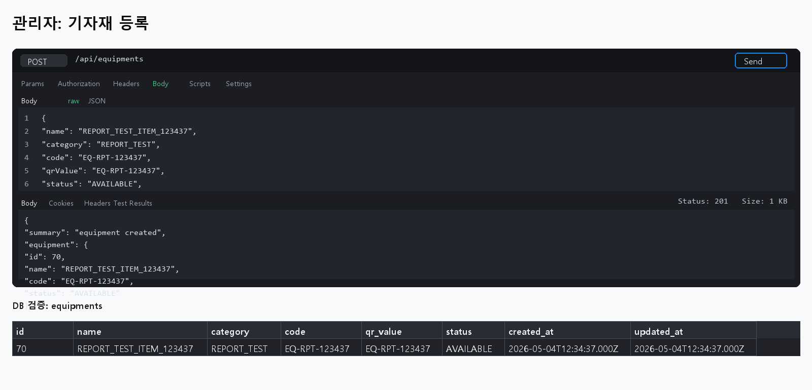

## 2. 관리자: 기자재 전체 조회

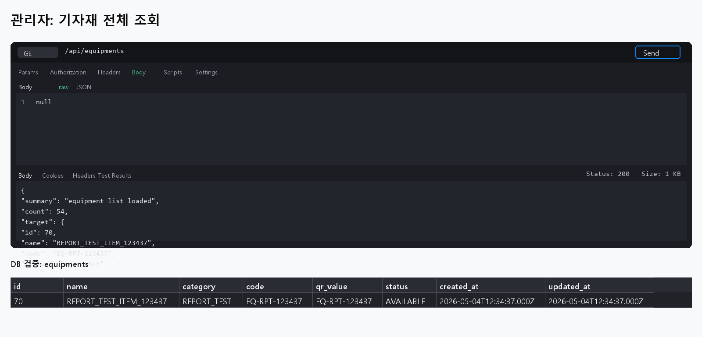

## 3. 관리자: 카테고리별 조회

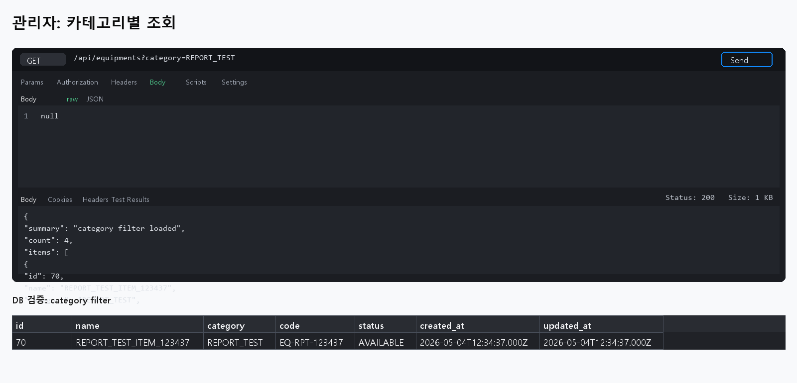

## 4. 관리자: 기자재 상세 조회

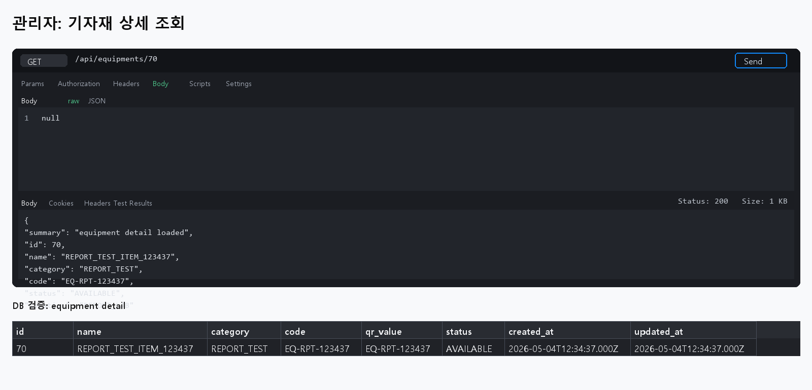

## 5. 사용자: QR 스캔 조회

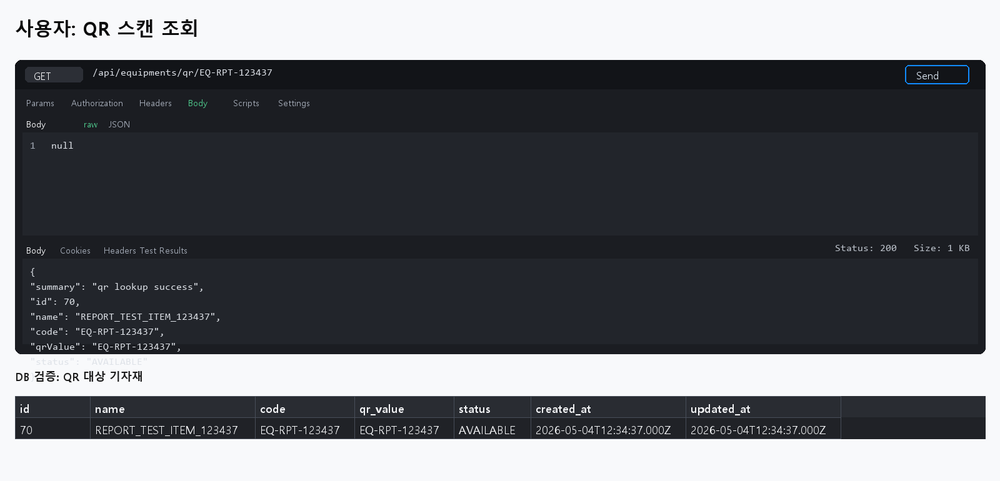

## 6. 사용자: 기자재 대여 요청

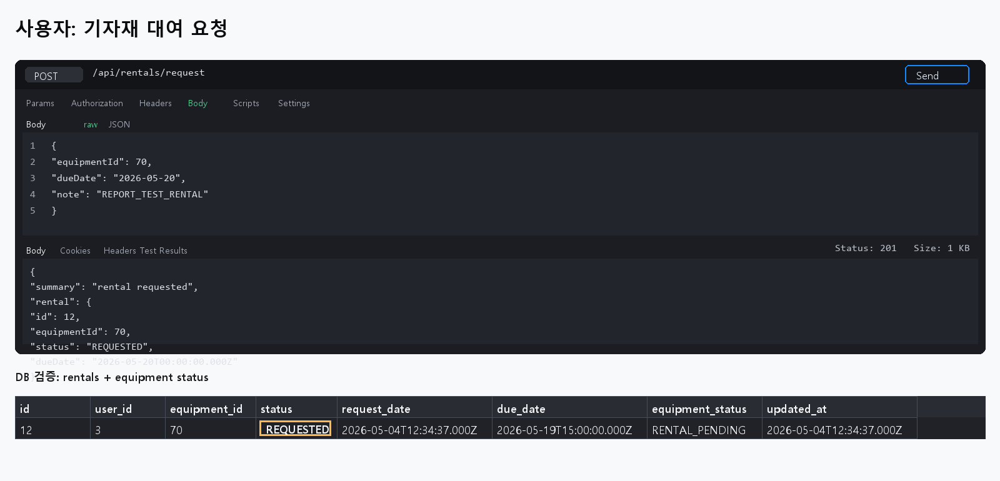

## 7. 관리자: 대여 승인 대기 조회

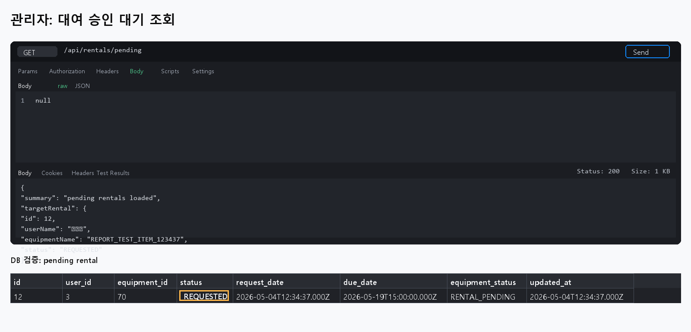

## 8. 관리자: 대여 승인 처리

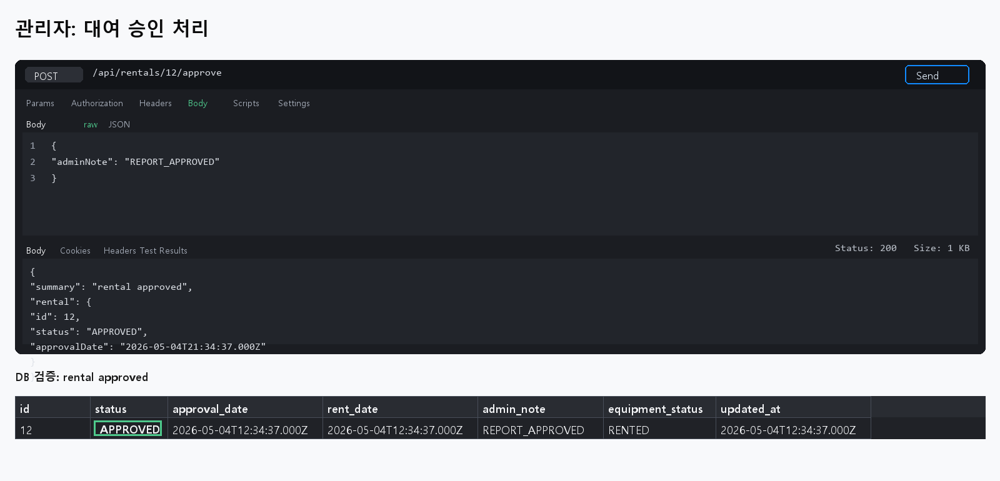

## 9. 사용자: 내 대여 내역 조회

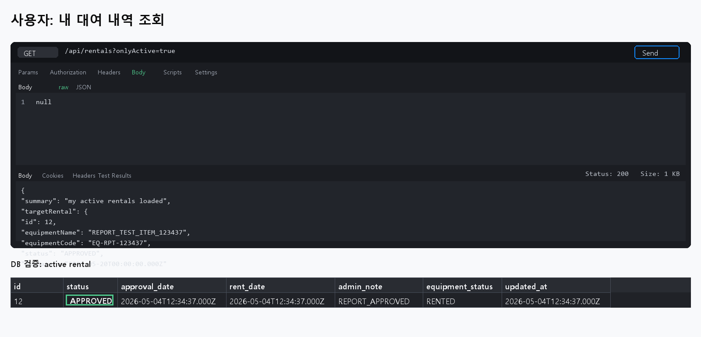

## 10. 사용자: 연장 요청

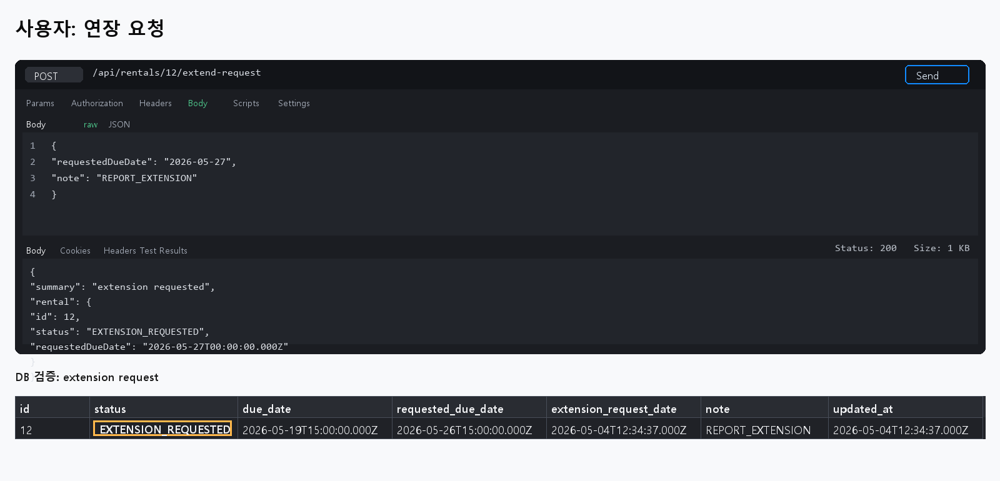

## 11. 관리자: 연장 승인 대기 조회

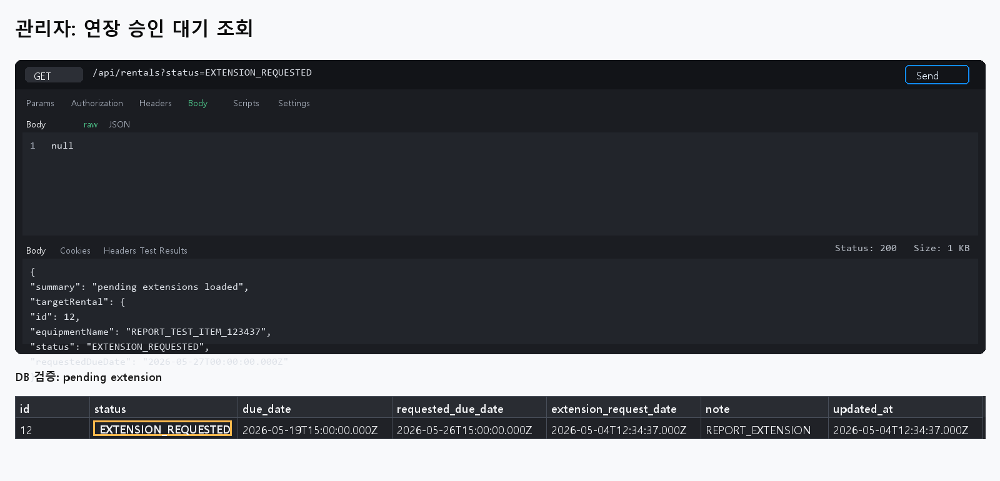

## 12. 관리자: 연장 승인 처리

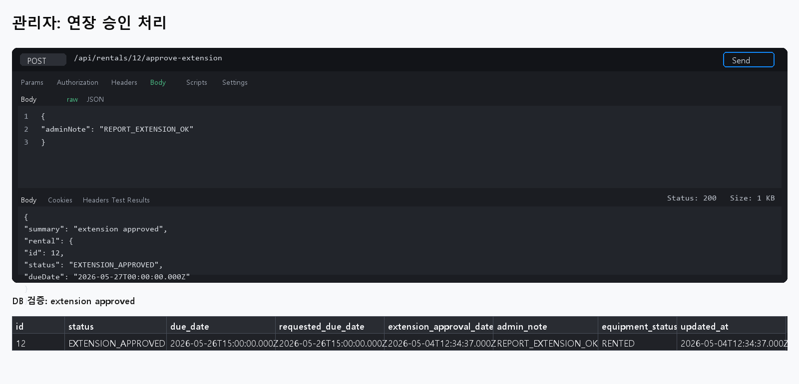

## 13. 사용자: 반납 요청

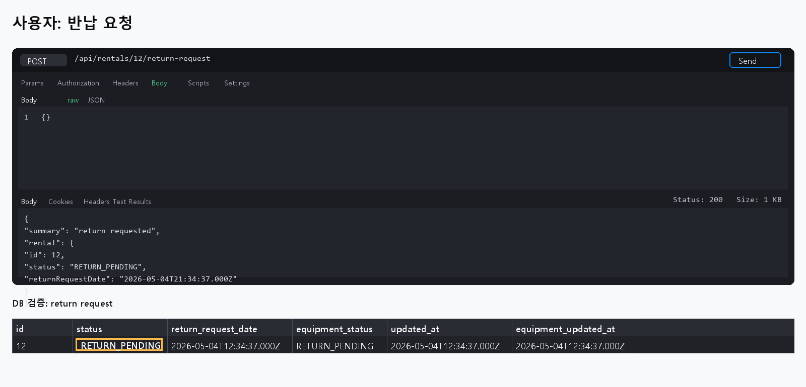

## 14. 관리자: 반납 승인 대기 조회

![관리자 반납 승인 대기 조회]Application_Situation_Screen Capture/test/14_admin_pending_returns.png)

## 15. 관리자: 반납 승인 처리

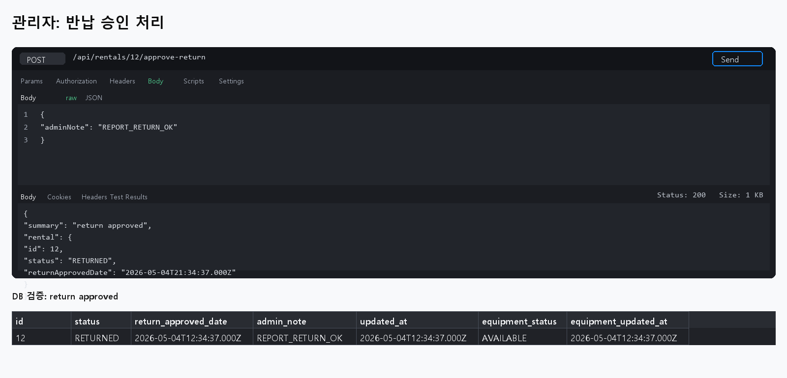

## 결론 
